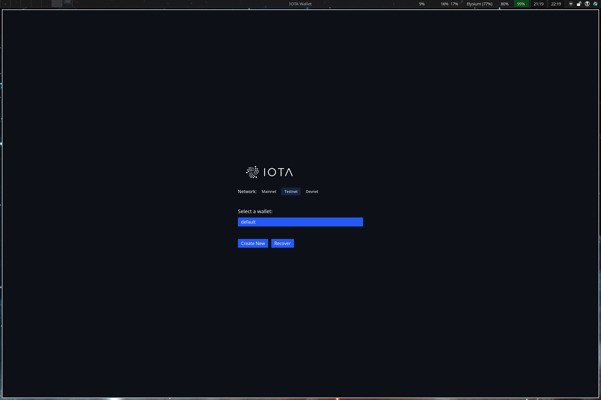
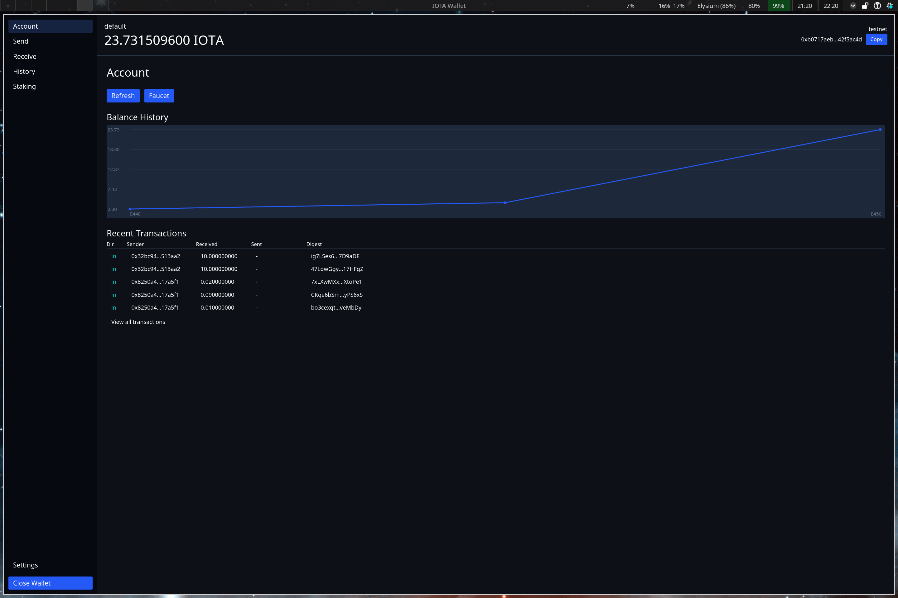

# IOTA Wallet

A Monero-inspired wallet for IOTA Rebased. Supports interactive mode, one-shot commands for scripting, a native GUI, and encrypted wallet files.

**NOTE: This is an EARLY PROTOTYPE. USE AT YOUR OWN RISK.**

## Install

**Pre-built binaries:**

Download the latest release from [GitHub Releases](https://github.com/franzos/iota-wallet/releases):

```bash
# Linux (x86_64)
curl -sL https://github.com/franzos/iota-wallet/releases/latest/download/iota-wallet-x86_64-unknown-linux-gnu.tar.gz | tar xz
sudo mv iota-wallet /usr/local/bin/

# macOS (Apple Silicon)
curl -sL https://github.com/franzos/iota-wallet/releases/latest/download/iota-wallet-aarch64-apple-darwin.tar.gz | tar xz
sudo mv iota-wallet /usr/local/bin/

# macOS (Intel)
curl -sL https://github.com/franzos/iota-wallet/releases/latest/download/iota-wallet-x86_64-apple-darwin.tar.gz | tar xz
sudo mv iota-wallet /usr/local/bin/
```

## Quick start

```bash
# Launch the REPL (testnet by default)
iota-wallet

# Use a named wallet
iota-wallet --wallet mywallet

# One-shot commands for scripting
iota-wallet --cmd "balance"
iota-wallet --cmd "address" --json
iota-wallet --wallet mywallet --password-stdin --cmd "balance" < password.txt

# Use a specific account index (derives a different address from the same seed)
iota-wallet --account 1 --cmd "address"
```

On first launch you'll be prompted to create a new wallet or recover from a seed phrase. The wallet file is encrypted with your password (argon2id + AES-256-GCM).

## Features

| Feature | CLI | REPL | GUI |
|---------|:---:|:----:|:---:|
| Send & receive IOTA | Yes | Yes | Yes |
| Send & receive tokens | Yes | Yes | Yes |
| NFTs | Yes | Yes | Yes |
| Staking | Yes | Yes | Yes |
| Transaction history | Yes | Yes | Yes |
| .iota name resolution | Yes | Yes | Yes |
| Sign & verify messages | Yes | Yes | Yes |
| On-chain notarization | Yes | Yes | Yes |
| Multi-account | Yes | Yes | Yes |
| QR code (receive) | - | - | Yes |
| QR code scan (send) | - | - | TODO |
| Balance chart | - | - | Yes |
| JSON output (`--json`) | Yes | Yes | - |
| Faucet (testnet/devnet) | Yes | Yes | Yes |

### Hardware wallets

| Feature | Ledger |
|---------|:------:|
| Connect & create wallet | Yes |
| Transaction signing | Yes |
| Address verification on device | Yes |
| Multi-account | Yes |
| Sign message | TODO |
| Display seed phrase | N/A |

## Ledger

Hardware wallet signing is supported via Ledger devices (Nano S, Nano S+, Nano X, Flex, Stax). The IOTA app must be installed and open on the device.

```bash
# CLI — select "Connect Ledger" when creating a new wallet
iota-wallet --wallet myledger

# GUI — click "Connect Ledger" on the welcome screen
iota-wallet-gui
```

Build with Ledger support:

```bash
cargo build --release --features ledger
```

## GUI




Launch the GUI with:

```bash
iota-wallet-gui
iota-wallet-gui --mainnet
iota-wallet-gui --devnet
```

The GUI supports wallet creation, recovery, sending/receiving IOTA, transaction history with pagination, staking/unstaking, a balance chart, multi-account switching, and password changes. The GUI requires X11 or Wayland on Linux.

## Commands

| Command | Aliases | Description |
|---------|---------|-------------|
| `balance` | `bal` | Show wallet balance |
| `address` | `addr` | Show wallet address |
| `transfer <addr> <amount>` | `send` | Send IOTA to an address |
| `sweep_all <addr>` | `sweep` | Send entire balance minus gas |
| `show_transfers [in\|out\|all]` | `transfers`, `txs` | Show transaction history |
| `show_transfer <digest>` | `tx` | Look up a transaction by digest |
| `stake <validator> <amount>` | | Stake IOTA to a [validator](https://explorer.iota.org/validators) |
| `unstake <object_id>` | | Unstake a staked IOTA object |
| `stakes` | | Show active stakes and rewards |
| `tokens` | `token_balances` | Show all coin/token balances |
| `status [node_url]` | | Show epoch, gas price, network, and node URL |
| `faucet` | | Request testnet/devnet tokens |
| `account [index]` | `acc` | Show current account or switch (e.g. `account 3`) |
| `seed` | | Display seed phrase (requires confirmation) |
| `password` | `passwd` | Change wallet encryption password |
| `help [cmd]` | | Show help |
| `exit` | `quit`, `q` | Exit the wallet |

Amounts are in IOTA (e.g. `1.5` for 1.5 IOTA). Tab completion is available in the REPL. All commands support `--json` output.

## Network

Testnet by default. Override with flags:

```bash
iota-wallet --mainnet
iota-wallet --devnet
iota-wallet --node https://custom-graphql-endpoint.example.com
iota-wallet --node http://localhost:9125/graphql --insecure
```

The `--insecure` flag allows plain HTTP connections (for local development). The network is stored in the wallet file. CLI flags override the stored config if explicitly set.

## Storage

Wallet files live in `~/.iota-wallet/`. Transactions are cached locally for pagination and balance history.

```
~/.iota-wallet/
├── default.wallet    # encrypted (mode 0600)
└── mywallet.wallet

# Linux: ~/.local/share/iota-wallet/
# macOS: ~/Library/Application Support/iota-wallet/
└── transactions.db   # SQLite cache (mode 0600)
```

File format: argon2id-derived key + AES-256-GCM. Override the wallet directory with `--wallet-dir`.

## Building

This is a Cargo workspace with three crates: `core` (shared library), `cli`, and `gui`.

```bash
cargo build --release
```

Run tests:

```bash
# Unit tests
cargo test

# Integration tests (hits testnet/devnet)
cargo test -- --ignored
```

## License

MIT
