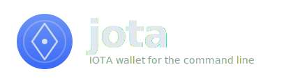
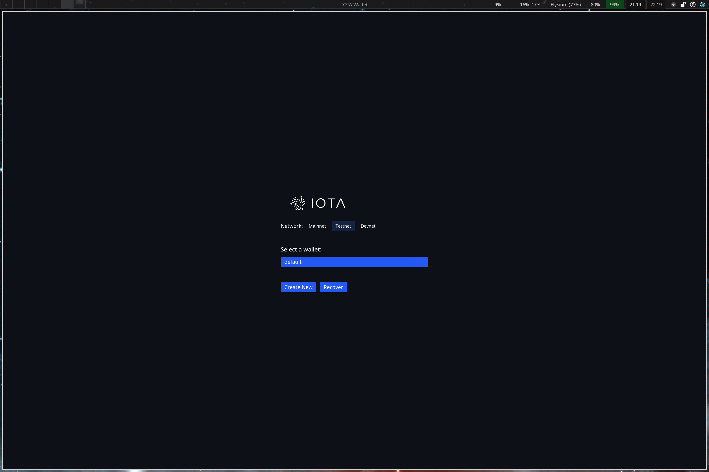

# Jota

<p align="center">
  
</p>
<p align="center">
  A Monero-inspired wallet for IOTA Rebased. Supports interactive mode, one-shot commands for scripting, a native GUI, and encrypted wallet files.
</p>

**NOTE: This is an EARLY PROTOTYPE. USE AT YOUR OWN RISK.**

## Install

| Method | Command |
|--------|---------|
| Homebrew | `brew tap franzos/tap && brew install jota` |
| Debian/Ubuntu | Download [`.deb`](https://github.com/franzos/jota/releases) — `sudo dpkg -i jota_*_amd64.deb` |
| Fedora/RHEL | Download [`.rpm`](https://github.com/franzos/jota/releases) — `sudo rpm -i jota-*.x86_64.rpm` |
| Guix | `guix install -L <panther> jota` ([Panther channel](https://github.com/franzos/panther)) |

Pre-built binaries for Linux (x86_64), macOS (Apple Silicon, Intel), AppImage and DMG on [GitHub Releases](https://github.com/franzos/jota/releases).

## Quick start

```bash
# Launch the REPL (testnet by default)
jota

# Use a named wallet
jota --wallet mywallet

# One-shot commands for scripting
jota --cmd "balance"
jota --cmd "address" --json
jota --wallet mywallet --password-stdin --cmd "balance" < password.txt

# Use a specific account index (derives a different address from the same seed)
jota --account 1 --cmd "address"
```

On first launch you'll be prompted to create a new wallet or recover from a seed phrase. The wallet file is encrypted with your password (argon2id + AES-256-GCM).

## Features

| Feature | CLI | REPL | GUI |
|---------|:---:|:----:|:---:|
| Send & receive IOTA | Yes | Yes | Yes |
| Send & receive tokens | Yes | Yes | Yes |
| NFTs | Yes | Yes | Yes |
| Staking | Yes | Yes | Yes |
| Transaction history | Yes | Yes | Yes |
| .iota name resolution | Yes | Yes | Yes |
| Sign & verify messages | Yes | Yes | Yes |
| On-chain notarization | Yes | Yes | Yes |
| Multi-account | Yes | Yes | Yes |
| Multi-signature | Yes | Yes | Yes |
| QR code (receive) | - | - | Yes |
| QR code scan (send) | - | - | TODO |
| Browser extension bridge | - | - | Yes |
| Balance chart | - | - | Yes |
| JSON output (`--json`) | Yes | Yes | - |
| Faucet (testnet/devnet) | Yes | Yes | Yes |

### Hardware wallets

| Feature | Ledger |
|---------|:------:|
| Connect & create wallet | Yes |
| Transaction signing | Yes |
| Address verification on device | Yes |
| Multi-account | Yes |
| Sign message | Yes |
| Display seed phrase | N/A |

## Ledger

Hardware wallet signing is supported via Ledger devices (Nano S, Nano S+, Nano X, Flex, Stax). The IOTA app must be installed and open on the device.

```bash
# CLI — select "Connect Ledger" when creating a new wallet
jota --wallet myledger

# GUI — click "Connect Ledger" on the welcome screen
jota-gui
```

Build with Ledger support:

```bash
cargo build --release --features ledger
```

## GUI




Launch the GUI with:

```bash
jota-gui
jota-gui --mainnet
jota-gui --devnet
```

The GUI supports wallet creation, recovery, sending/receiving IOTA, transaction history with pagination, staking/unstaking, a balance chart, multi-account switching, and password changes. The GUI requires X11 or Wayland on Linux.

## Browser Extension

A companion browser extension bridges dApps (like the [IOTA Wallet Dashboard](https://wallet-dashboard.iota.org/)) to the desktop wallet via Chrome Native Messaging. The extension implements the [Wallet Standard](https://github.com/wallet-standard/wallet-standard), so any dApp using `@iota/dapp-kit` will discover it automatically.

**Setup:**

1. Download `jota-extension.zip` from [Releases](https://github.com/franzos/jota/releases) and unzip it
2. Open `chrome://extensions`, enable Developer mode, click "Load unpacked", select the unzipped folder
3. Click the extension icon in the toolbar — copy the Extension ID
4. In the wallet GUI, go to Settings → Browser Extension, paste the ID, click "Install Native Host"

When a dApp requests signing, the wallet GUI shows an approval modal. If the GUI is already running, Chrome-spawned instances act as headless relays (no duplicate window).

Tested with [CyberPerp](https://mainnet.cyberperp.io/), [IOTA Wallet Dashboard](https://wallet-dashboard.iota.org/), [Virtue Money](https://app.virtue.money/), and others.

**Build from source:**

```bash
cd extension
npm install
node build.mjs
```

## Commands

| Command | Aliases | Description |
|---------|---------|-------------|
| `balance` | `bal` | Show wallet balance |
| `address` | `addr` | Show wallet address |
| `transfer <addr> <amount>` | `send` | Send IOTA to an address |
| `sweep_all <addr>` | `sweep` | Send entire balance minus gas |
| `show_transfers [in\|out\|all]` | `transfers`, `txs` | Show transaction history |
| `show_transfer <digest>` | `tx` | Look up a transaction by digest |
| `stake <validator> <amount>` | | Stake IOTA to a [validator](https://explorer.iota.org/validators) |
| `unstake <object_id>` | | Unstake a staked IOTA object |
| `stakes` | | Show active stakes and rewards |
| `tokens` | `token_balances` | Show all coin/token balances |
| `status [node_url]` | | Show epoch, gas price, network, and node URL |
| `faucet` | | Request testnet/devnet tokens |
| `account [index]` | `acc` | Show current account or switch (e.g. `account 3`) |
| `seed` | | Display seed phrase (requires confirmation) |
| `password` | `passwd` | Change wallet encryption password |
| `multisig <subcommand>` | `ms` | Multi-signature operations (see below) |
| `help [cmd]` | | Show help |
| `exit` | `quit`, `q` | Exit the wallet |

Amounts are in IOTA (e.g. `1.5` for 1.5 IOTA). Tab completion is available in the REPL. All commands support `--json` output.

### Multi-signature

IOTA's native multi-sig uses a weighted threshold scheme: each signer has a public key with a weight, and the address has a threshold. A transaction is valid when collected signatures' weights meet or exceed the threshold. Up to 10 participants per address, with mixed key schemes (Ed25519, Secp256k1, Secp256r1).

Participants share public keys and proposals via self-contained JSON files (`.jota-multisig`, `.jota-proposal`, `.jota-sig`) — no server required. Transaction contents are always decoded from the raw bytes, never from advisory metadata.

| Subcommand | Description |
|------------|-------------|
| `multisig create <name>` | Interactive wizard to set up a new multisig address |
| `multisig import <file>` | Import a `.jota-multisig` address definition |
| `multisig export <name>` | Export a `.jota-multisig` for sharing with participants |
| `multisig list` | List configured multisig addresses |
| `multisig show <name>` | Show participants, weights, threshold, and on-chain balance |
| `multisig remove <name>` | Remove a multisig config (local only) |
| `multisig send <name> <recipient> <amount>` | Propose a transfer, exports `.jota-proposal` |
| `multisig sign <file>` | Review and sign a `.jota-proposal`, exports `.jota-sig` |
| `multisig add-sig <id> <file>` | Import a `.jota-sig` or updated `.jota-proposal` |
| `multisig submit <id>` | Combine signatures and execute on-chain |
| `multisig proposals [name]` | List pending proposals |
| `multisig proposal <id>` | Show proposal details and signature status |
| `multisig cancel <id>` | Mark a proposal as cancelled locally |

## Network

Testnet by default. Override with flags:

```bash
jota --mainnet
jota --devnet
jota --node https://custom-graphql-endpoint.example.com
jota --node http://localhost:9125/graphql --insecure
```

The `--insecure` flag allows plain HTTP connections (for local development). The network is stored in the wallet file. CLI flags override the stored config if explicitly set.

## Storage

All persistent data lives in the XDG data directory (`~/.local/share/jota/` on Linux, `~/Library/Application Support/jota/` on macOS). The socket uses `$XDG_RUNTIME_DIR`.

```
~/.local/share/jota/
├── default.wallet    # encrypted (mode 0600)
├── mywallet.wallet
├── permissions.json  # dApp origin permissions
├── transactions.db   # SQLite cache (mode 0600)
└── multisig/
    ├── company-funds.json              # multisig config (plain JSON)
    └── proposals/
        └── a3f7b2c1...full-hex.json   # transaction proposal

$XDG_RUNTIME_DIR/jota/
└── gui.sock          # single-instance relay
```

File format: argon2id-derived key + AES-256-GCM. Override the wallet directory with `--wallet-dir`.

## Building

This is a Cargo workspace with three crates: `core` (shared library), `cli`, and `gui`, plus a browser `extension`.

```bash
# Rust (CLI + GUI)
cargo build --release

# Browser extension
cd extension && npm install && node build.mjs
```

Run tests:

```bash
# Unit tests
cargo test

# Integration tests (hits testnet/devnet)
cargo test -- --ignored
```

## License

MIT
